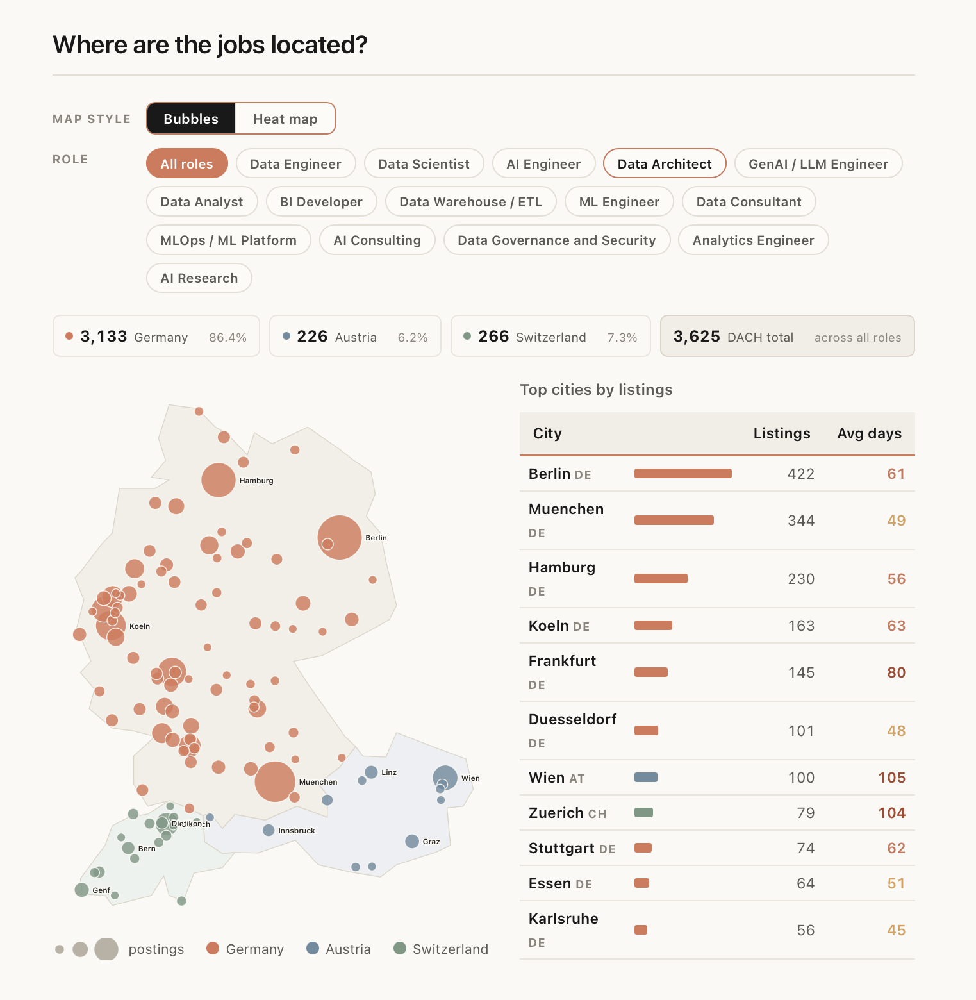
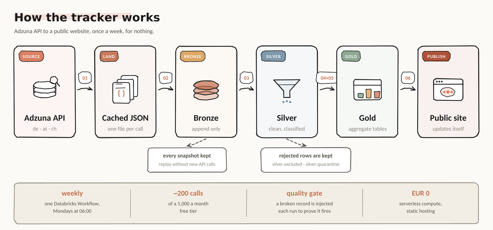

# What's up with the data-job market in Austria/Germany/Switzerland?


**[Open the live tracker](https://Chrisinho8.github.io/DACH-data-job-market/)** · last updated 6 August 2026

A weekly snapshot of the DACH data-job market: **3,900+ live postings from 1,400+ employers** across Germany, Austria and Switzerland. Every Monday at 06:00 a Databricks pipeline queries the Adzuna API for 16 data related job titles in all three countries, deduplicates and classifies the results through a bronze/silver/gold Delta Lake, scans each posting against a curated 47-term skills dictionary. It then gets published to a static GitHub Page.

## How the tracker might help you

- **See the shape of the market** - volumes by role, city and country, how long postings stay open, seniority mix, tool mentions, English-language share, salary disclosure.
- **Read the postings behind any number.** Every chart is a count of real adverts, and those adverts are browsable: search by title or employer, filter by role family, country, city and seniority, sort by newest or longest-open, 20 per page. Titles link out to the aggregator.
- **Drill down from a chart.** Click a city on the map or a bar in any role chart and the list below filters to it. Nothing on the site is a number you have to take on trust.
- **Watch it move.** Nothing is ever overwritten, so each run adds to the record and every figure gains a second dimension: not just how many AI roles are open, but whether that number is climbing.

## Overview of the Map

Snapshot of 2026-08-05.
 

 
Above: the map view. Bubbles are sized by posting count and coloured by country - Germany coral, Austria blue, Switzerland green. Pick any of the 15 role families and the whole view re-cuts to it: bubbles, the four country totals, and the top-cities table with each city's average days open. Click a bubble or a table row and the browsable posting list below filters to that city.

## Main take-aways

**Germany is the biggest market; Austria and Switzerland are footnotes.** 3,133 of 3,625 postings are German - 86.4%, against 6.2% Austrian and 7.3% Swiss. The blue and green clusters on the map are Vienna, Graz, Linz, Innsbruck and the Zurich–Bern–Geneva line, and that is close to all of them. Any single-country claim about AT or CH rests on a few dozen adverts per family.
 
**Hiring is concentrated in a handful of cities.** Berlin (422) and Munich (344) are 21% of DACH between them; the top five are 36%. The rest is spread across 250-odd cities - the scatter of small bubbles through the Rhine-Ruhr and the south - most of them carrying single-digit counts.
 
**Speed varies more by city than by role.** Düsseldorf clears in 48 days and Munich in 49, while Frankfurt sits at 80, Zurich at 104 and Vienna at 105. The two non-German capitals are the slowest markets on the board, at more than twice Munich's pace, and the red figures in the "Avg days" column are where that shows.
 
**Berlin and Munich are where AI hiring is the most prominent.** 37% of Berlin's postings and 42% of Munich's are AI-related roles, against 19% in Hamburg and 13% in Düsseldorf. Berlin is also the most international: 58.5% of its postings are in English, versus 14.9% in Düsseldorf.

 

## Scope: what counts as a data job

**Data:** data engineer, data analyst, data scientist, data architect, analytics engineer, DWH / ETL, data governance, data consultant, BI developer.

**AI:** AI engineer, GenAI / LLM, ML engineer, MLOps, AI consultant, AI research.

| Excluded | Why |
|---|---|
| Titles saying "AI"/"KI" and naming no role | A title cannot tell an AI job from a job at a company that likes the word. The rule still runs and still catches them, but they are dropped. **AI figures are a floor, not a total.** |
| Data **centre** infrastructure | False friend: "Data Center Engineering Operations" is physical infrastructure |
| General software, cloud and DevOps engineering | Not data roles, pulled in by keyword overlap |
| Speculative applications, parse artefacts | Not job postings at all |

Excluded rows land in `silver.excluded` so the decision stays auditable.

## Architecture

```
Adzuna API              de · at · ch, 16 job titles
    │
    ▼
Unity Catalog volume    raw JSON cached, one file per query
    │
    ▼
Auto Loader             trigger availableNow
    │
    ▼
BRONZE    Delta         append-only, every snapshot preserved
    │
    ▼
SILVER    Delta         parsed, classified, scope-filtered,
    │                   deduplicated, quality-gated
    ▼
GOLD      Delta         aggregates + weekly history,
    │                   postings_public (the one row-level table)
    ▼
docs/data/*.json        committed to this repo
    │
    ▼
GitHub Pages            static site, no backend
```



**Browsing the postings.** Everything on the site is a count except one table. `gold.postings_public` ships as `docs/data/postings.json` and backs the searchable list. It carries title, employer, city, role family, seniority, age and the aggregator's `redirect_url` - not descriptions (not ours to redistribute, and 99.6% are truncated anyway) and not salary (mostly the aggregator's own prediction). Rows without a link are dropped rather than rendered dead.

**Skill extraction.** A curated dictionary of 47 terms, not an LLM, so every match points at a specific string in a specific posting and the counts are reproducible. The traps are real: "SQL" hides inside "PostgreSQL", "Java" inside "JavaScript", a bare "R" matches "R&D" and half of every German address block. Each one is pinned by a test in `tests/test_matcher.py` that runs in CI on every push. See `src/matcher.py`.

**Deduplication.** Postings are hashed on title, company, city and the first 200 characters of the description; the earliest listing wins. Query overlap is counted separately from genuine reposts and is not published as a finding.


**Location.** From each posting's own location array. In the city-states (Berlin, Hamburg, Bremen, Vienna, Basel, Geneva) the third level is a district and is collapsed into the parent. Administrative wrappers (`(Kreis)`, `-Umgebung`, `-Land`, `Region ...`) are stripped.

## Limitations of this tracker


- **`created` is the aggregator's date**, possibly when it indexed the posting rather than when the employer published it.
- **Descriptions are capped at 500 characters** and 99.6% are truncated. Tool counts measure *mentioned in the title or opening paragraph* - a floor, not a requirement rate. The window is identical for every posting, so comparing tools holds; absolute rates do not.
- **AI counts are a floor**, for the reason in the scope table. The dropped share is printed on every run of `03_silver_clean.py`; if it climbs, the six rules are going stale.
- **A posting in the browser is not necessarily open.** It was live at the last refresh. Nothing re-checks whether it has since been filled or withdrawn.
- **Roles and seniority are inferred from titles**, so both carry classification error.
- **Agency detection is keyword based** and flags only 3.9%, almost certainly an undercount.
- **6.3% of records are rejected** by the quality rules each run and quarantined rather than silently dropped.


## Running it yourself

1. Get an `app_id` and `app_key` from `developer.adzuna.com`.
2. Create a Databricks workspace (Free Edition is enough) and run `notebooks/setup_uc.py` to create the catalog, schemas and volumes.
3. Put credentials in the `conf` volume, outside this repo:

```python
pathlib.Path("/Volumes/jobs/bronze/conf/adzuna.json").write_text(
    json.dumps({"app_id": "...", "app_key": "..."}))
```

4. Import `notebooks/` and run 01 to 06 in order.
5. Chain them into a weekly Databricks Workflow.

```bash
pip install -r requirements.txt && pytest tests/ -v
```

## Tech stack

Databricks Free Edition, Delta Lake, Auto Loader, Unity Catalog, PySpark, Databricks Workflows, GitHub Actions and Pages, Chart.js, SQL.

## Licence

MIT. The underlying job data belongs to Adzuna and its source boards.
